# Smart Bike Monitor 🚴‍♂️⚡

<p align="center">
  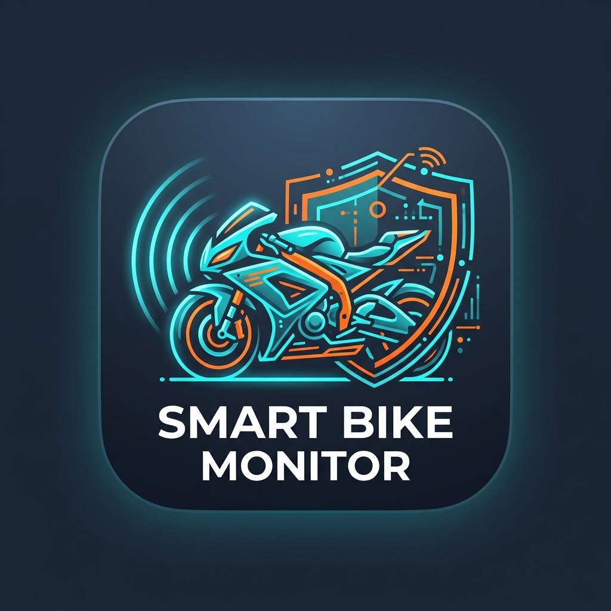
</p>

<p align="center">
  <b>Intelligent Two-Wheeler Safety, BLE Telemetry & Automated Accident Emergency Dispatch</b>
</p>

---

## 📱 Mobile App UI Gallery

<p align="center">
  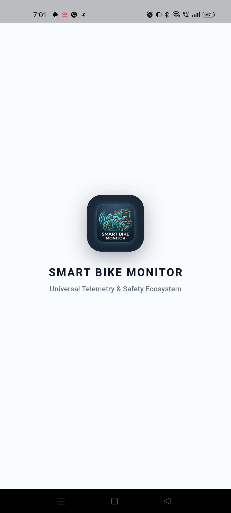
  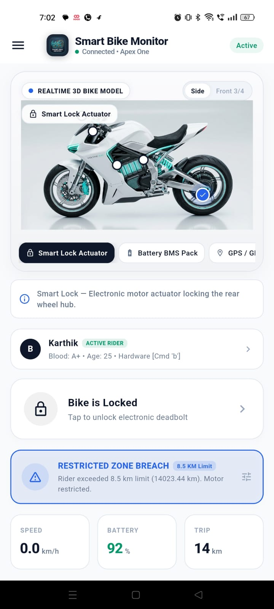
  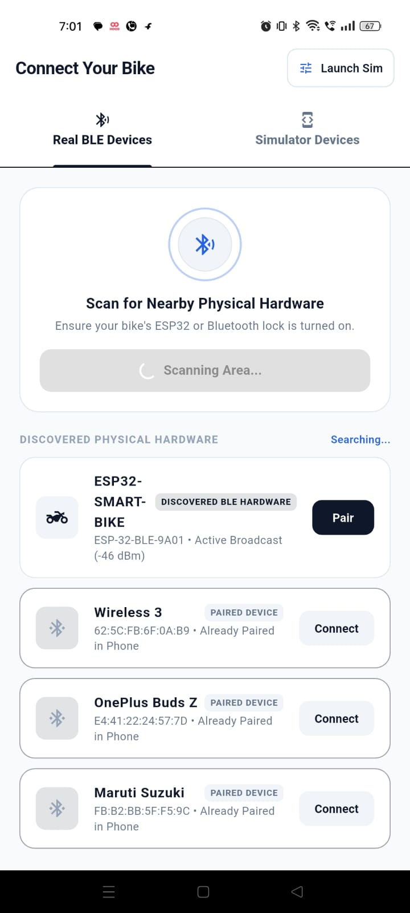
</p>
<p align="center">
  <i>Splash Screen &nbsp;•&nbsp; Live Telemetry Dashboard &nbsp;•&nbsp; Hardware BLE Scanner &nbsp;•&nbsp; Accident Alert HUD</i>
</p>

<p align="center">
  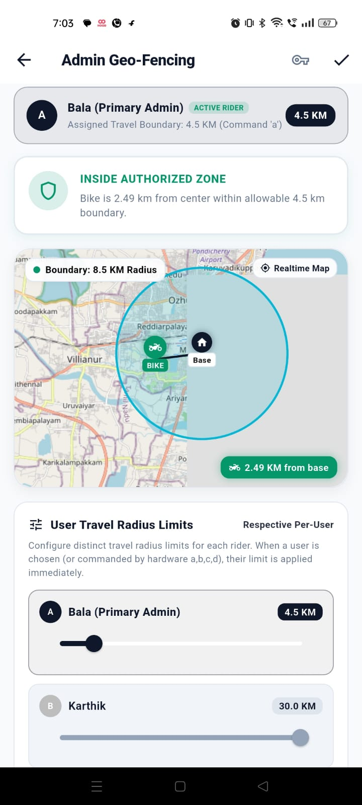
  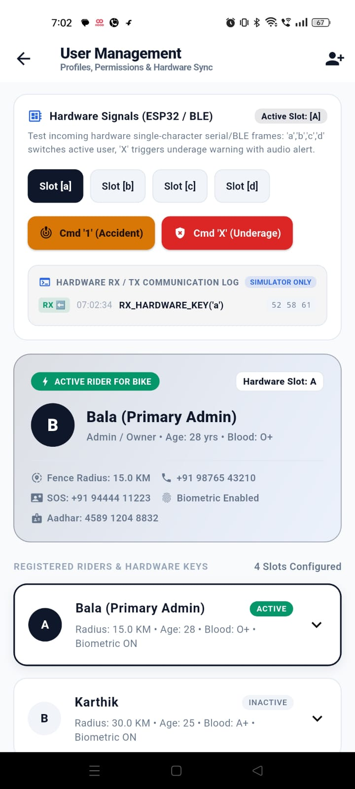
  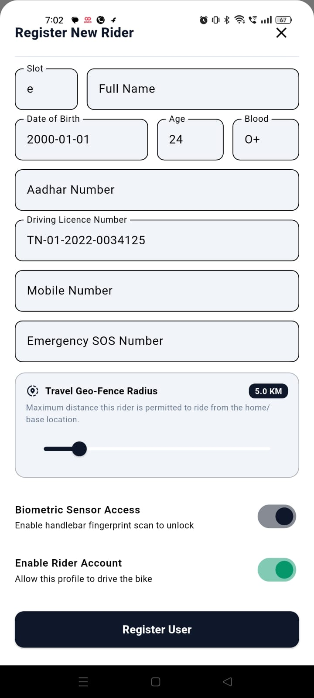
  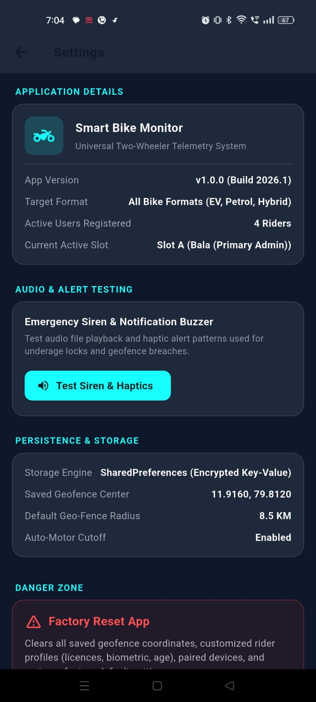
</p>
<p align="center">
  <i>Geofencing & Map &nbsp;•&nbsp; User Management & Signals &nbsp;•&nbsp; Rider Registration & License &nbsp;•&nbsp; App Settings & Reset</i>
</p>

<p align="center">
  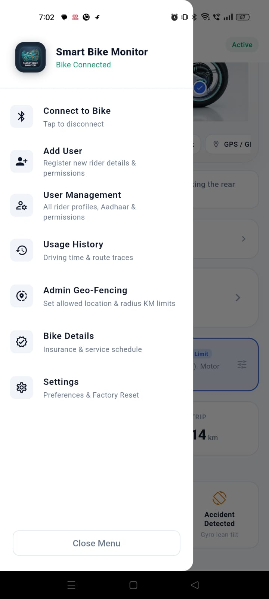
  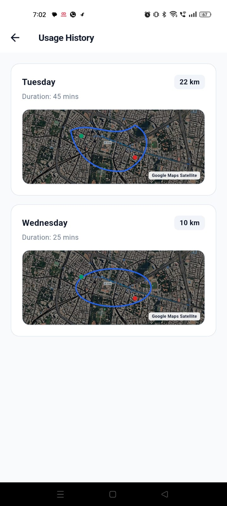
  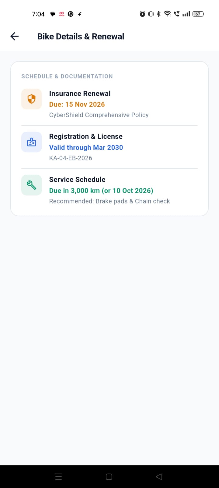
</p>
<p align="center">
  <i>Navigation Menu &nbsp;•&nbsp; Route & Usage History &nbsp;•&nbsp; Insurance & Service Schedule</i>
</p>

---

## 🌟 Key Highlights & Features

### 1. 🛡️ Real-Time Accident Detection & Emergency Dispatch
- **Hardware Trigger Integration**: Instantaneous detection via BLE command `'1'` from ESP32 crash sensor or accelerometer thresholds.
- **Dynamic GPS Location Fetch**: Real-time vehicle coordinates captured directly from telemetry and GPS geofence tracking.
- **Automated Emergency Routing**:
  - Dynamically calculates distance to real nearby hospitals based on current coordinates (e.g. Puducherry JIPMER, General Hospital, Indira Gandhi Institute, etc.).
  - Simulates instantaneous emergency calls and ambulance dispatch broadcast.
  - Custom audible emergency siren sound (`alert.wav`) and prominent HUD emergency modal.

### 2. 📡 Real Hardware Dual-Mode Bluetooth (HC-05 v2.0 SPP & BLE) & Simulator
- **HC-05 Bluetooth v2.0 & BLE Dual Compatibility**:
  - Full hardware compatibility for **HC-05 / HC-06 Bluetooth v2.0 serial modules** via native Android RFCOMM SPP socket (`00001101-0000-1000-8000-00805F9B34FB`).
  - Seamless automatic switching between **Bluetooth Classic Serial Port Profile (SPP)** and **BLE 4.0/5.0 GATT** based on connected hardware.
  - Receives standard hardware ASCII trigger signals (`'1'` for Accident detection, `'X'` for Underage lock, `'a'/'b'/'c'/'d'` for rider slots) as well as binary framed packets.
- **Android Native Bluetooth MethodChannel**:
  - Automatically verifies Android Bluetooth permissions (`BLUETOOTH_SCAN`, `BLUETOOTH_CONNECT`, `ACCESS_FINE_LOCATION`, `BLUETOOTH_ADMIN`).
  - Prompts to turn on phone Bluetooth if disabled before initiating scan.
  - Discovers both bonded Bluetooth Classic (HC-05) devices and live BLE broadcast beacons.
- **Full Bidirectional Protocol Framing**:
  - 8-byte framed packets: `[SOF1(0xAA), SOF2(0x55), Seq, CmdID, Len(2), Payload(N), CRC16(2)]`.
  - CRC-16-CCITT packet verification and automatic chunk assembly.
- **Dedicated Simulator & Serial Log View**:
  - Built-in simulation mode with mock hardware peripherals for development without physical bike hardware.
  - Real-time **RX & TX Communication Log Console** displaying sent and received packet frames.

### 3. 🌐 Admin Geofencing & Vehicle Tracking
- Visual circular perimeter map with interactive radius adjustment (100m to 5000m).
- Speed governor limits and max speed alarms.
- Instant restriction toggles:
  - Motor Kill Switch
  - Anti-Theft Alarm Siren
  - Ignition Lock & Immobilizer
- Debounced persistence: Prevents duplicate notification spam while adjusting settings.

### 4. 👥 Driver Management & Licensing
- User profiles with Name, Phone, Role, and **Driving License Number**.
- Clean CRUD management with persistent state.

### 5. ⚙️ Settings & System Reset
- Persistent app preferences stored across sessions.
- In-menu **App Settings** with a complete Factory Reset option to restore default telemetry and geofence parameters.

---

## 🏛️ System Architecture

```text
               ┌───────────────────────────────────────┐
               │         Flutter UI (Material 3)       │
               │   Dashboard | Geofencing | Users      │
               └───────────────────┬───────────────────┘
                                   │
                                   ▼
               ┌───────────────────────────────────────┐
               │    Riverpod Controller & State        │
               │         (BikeController)              │
               └───────────────────┬───────────────────┘
                                   │
                                   ▼
               ┌───────────────────────────────────────┐
               │            Bike Repository            │
               │        (BikeRepositoryImpl)           │
               └───────────────────┬───────────────────┘
                                   │
                                   ▼
               ┌───────────────────────────────────────┐
               │       BLE Service & Native Bridge     │
               │ (ReactiveBleService / MethodChannel)  │
               └───────────────────┬───────────────────┘
                                   │
                                   ▼
               ┌───────────────────────────────────────┐
               │       BLE Binary Protocol Parser      │
               │     (Framing, CRC16, MTU Chunking)    │
               └───────────────────┬───────────────────┘
                                   │
                                   ▼
               ┌───────────────────────────────────────┐
               │         ESP32 Firmware (GATT)         │
               │   Sensors + Lock + GPS + Crash Sensor │
               └───────────────────────────────────────┘
```

---

## 📂 Project Structure

```
├── android/                   # Native Android wrapper with Bluetooth MethodChannel
├── assets/
│   ├── audio/alert.wav        # Accident alarm audio sound
│   └── images/app_logo.png    # Smart Bike Monitor official logo
├── firmware/
│   └── esp32_smart_bike.ino   # ESP32 BLE GATT Server & Sensor Firmware
├── lib/
│   ├── data/
│   │   ├── repositories/      # BikeRepositoryImpl & domain mapping
│   │   └── services/          # BLE framing, CRC-16 protocol, ReactiveBle
│   ├── domain/
│   │   └── models/            # BikeTelemetry, GpsData, User, GeofenceConfig
│   ├── theme/                 # Modern cyber-dark UI theme tokens
│   ├── ui/features/bike/
│   │   ├── view_models/       # BikeController (StateNotifier)
│   │   └── views/             # Dashboard, Geofencing, Pairing, Users, Settings
│   └── main.dart              # Application entry point
├── test/                      # Unit & integration test suites
├── BLE_PROTOCOL_SPEC.md       # Detailed byte-level binary framing specification
└── simulator.html             # Standalone web test bench for hardware communication
```

---

## 🚀 Getting Started

### Prerequisites
- [Flutter SDK](https://flutter.dev) (>=3.0.0)
- Android Studio / VS Code with Flutter extension
- Android Device with Bluetooth 4.2+ (BLE) or Android Emulator

### Installation & Run

1. **Clone the repository**:
   ```bash
   git clone https://github.com/Balajiece2023/smart-bike-monitor.git
   cd smart-bike-monitor
   ```

2. **Install Flutter dependencies**:
   ```bash
   flutter pub get
   ```

3. **Run unit tests**:
   ```bash
   flutter test
   ```

4. **Launch on connected Android device**:
   ```bash
   flutter run -d <device_id>
   ```

---

## 📡 BLE Protocol Overview

Frames sent between the ESP32 and Flutter app conform to the following 8-byte framing structure:

| Field | Size | Description |
|---|---|---|
| `SOF1` | 1 Byte | Start of Frame 1 (`0xAA`) |
| `SOF2` | 1 Byte | Start of Frame 2 (`0x55`) |
| `Seq` | 1 Byte | Rolling sequence counter (`0x00`-`0xFF`) |
| `CmdID` | 1 Byte | Command identifier (e.g. Telemetry, Lock, Alarm) |
| `Length` | 2 Bytes | Big-Endian payload length `N` |
| `Payload` | `N` Bytes | Serialized payload bytes |
| `CRC16` | 2 Bytes | CRC-16-CCITT checksum over `[Seq .. Payload]` |

Refer to [BLE_PROTOCOL_SPEC.md](BLE_PROTOCOL_SPEC.md) for complete opcode tables and payload schemas.

---

## 🛡️ License

This project is licensed under the MIT License - see the LICENSE file for details.
